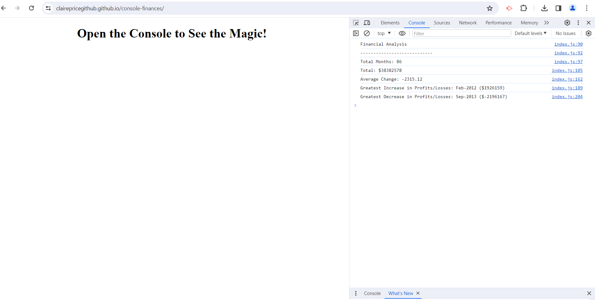

# Console Finances

## Description

Project to create code which will analyse the financial records of a company, after being provided with a financial dataset. Creating this code enables useful information for a business to be easily extracted.
This project developed fundamental JavaScript knowledge requiring research and testing of code.
On completion of this project I became comfortable with handling a financial dataset and extracting and manipulating useful information, and I also understand the usefulness of using code for these purposes

## Installation

N/A

## Usage

Open in the browser and open the developer console to view analysis results

https://clairepricegithub.github.io/console-finances/

## Credits

index.js lines 167-186:  
Stack Overflow. 2012, July 2. *Return index of greatest value in an array*. https://stackoverflow.com/questions/11301438/return-index-of-greatest-value-in-an-array

## License

Please refer to the LICENSE in the repo